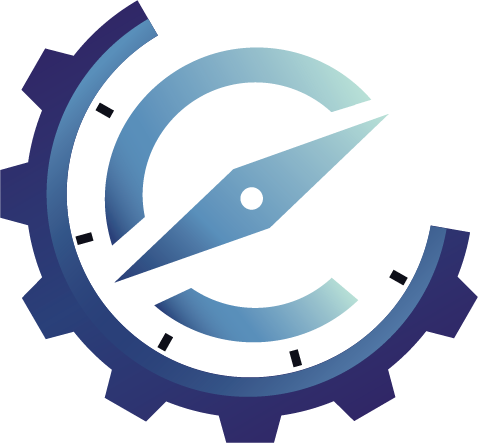

<div align="center">



# Eterion Website

This project is for Eterion. Eterion is name for the Information Technology students ITS batch 2024.

</div>

## List of Contents

1. ⚡ Tech Stack

2. 🚀 Getting Started

   - 📓 Prerequisites
   - ⛓️ Installation

3. 📚 Usage

4. 👷 Workflow

## Tech Stack

- Next.js

  Web Framework based on React. [Visit Docs](https://nextjs.org/)

- TailwindCSS

  For css Framework with utility first. [Visit Docs](https://tailwindcss.com/)

- Shadcn UI (if needed)

  Component library build with Tailwind and Radix Primitives. [Visit Docs](https://ui.shadcn.com/)

## Getting Started

### Prerequisites

- Nodejs (LTS)
- pnpm (package manager)

### Installation

1. Clone repository

```sh
https://github.com/ardhptr21/eterion-website.git
```

2. Move into directory

```sh
cd eterion-website
```

3. Install dependencies

```sh
pnpm install
```

## Usage

1. Development server

For development purpose you can run command below

```sh
pnpm dev
```

2. Build

If you want build the website into production run command below

```sh
pnpm build
```

3. Preview production

After build and you want to preview the website you can run command below

```sh
pnpm start
```

## Workflow

> Branch

We will use 2 branch

- `main` for the production
- `dev` for the development

And each task should make a sub branch from the `dev` branch, and then after the task is done you must make a **pull request** from the sub branch into `dev` branch.

> Point by point

1. Create a sub-branch from the `dev` branch for each task.
2. Aftar task is done, make a `pull request` into `dev` branch from the current sub-branch.
3. PIC will review your code, and if the code is working as expected then the `pull request` will be merged, if not the task must be revised.
4. Aftar `pull request` merged then your task is done.
